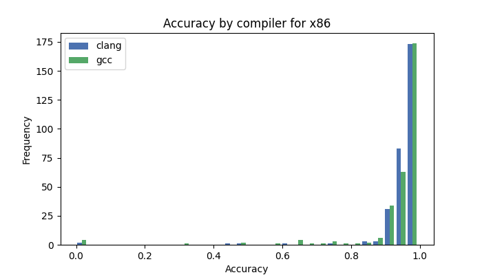
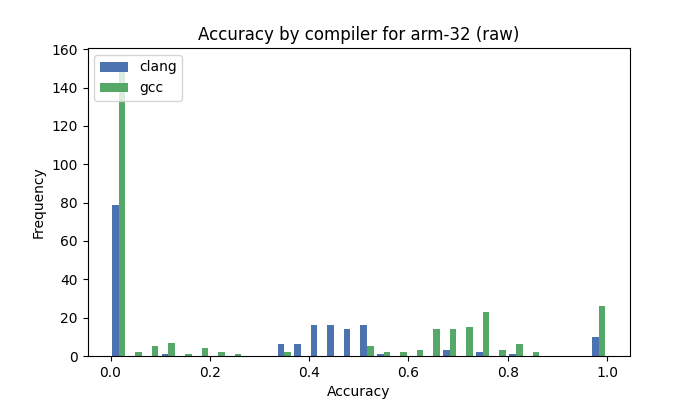

# Nucleus Forensics Project

Students:

- Vincenzo Mezzela ( [mezzela@eurecom.fr](mailto:mezzela@eurecom.fr) )
- Ilaria Pilo ( [pilo@eurecom.fr](mailto:pilo@eurecom.fr) )

## Table Of Contents

- [Project description](#project-description)
  - [Reorganization of the directory tree](#reorganization-of-the-directory-tree)
  - [Fixing the tool](#fixing-the-tool)
  - [Raw files support](#raw-files-support)
  - [Evaluating different architectures performance](#evaluating-different-architectures-performance)
  - [Raw files support evaluation](#raw-files-support-evaluation)
- [Makefile commands](#makefile-commands)
- [Usage](#nucleus-usage)

---

## Project Description

The Nucleus project for the Forensics course aims to enhance and revitalize an existing tool called Nucleus, available at [https://bitbucket.org/vusec/nucleus/src/master/](https://bitbucket.org/vusec/nucleus/src/master/). Nucleus is primarily designed to locate function headers in stripped binaries, aiding in the analysis of binary files. However, due to changes in library APIs, the tool was no longer functioning as intended.

The outperformed tasks can be categorized into the following areas of improvement:

1. [**Reorganization of the directory tree**](#reorganization-of-the-directory-tree):
   The initial task involves cloning the Nucleus repository and enhance the directory structure with respect to the basic version proposed [initially](https://bitbucket.org/vusec/nucleus/src/master/) which is pretty basic. This improves code maintainability, readability, and collaboration.
   <!-- TODO migliorare qui -->

2. [**Fixing the Tool**](#fixing-the-tool):
   We address the issues preventing Nucleus from functioning correctly. By understanding the changes in library APIs and making the necessary modifications to the codebase, we completely restore the tool's functionality.

3. [**Raw files support**](#raw-files-support):
   The tool currently focuses on Portable Executable (PE) and Executable and Linkable Format (ELF) binaries. However, there is still room for improvement in supporting raw binary files.

4. [**Evaluating different architectures performance**](#evaluating-different-architectures-performance):
   While Nucleus has undergone extensive testing for x86 architecture, the effectiveness of its approach on other architectures remains uncertain. For this task, we exploit a large number of binaries (~3000) belonging to different architectures, along with their ground truth. We build an additional, more complete ground truth using the `nm` and `readelf` tools to carry out further testing.

5. [**Raw files support evaluation**](#raw-files-support-evaluation):
   This last task aims to evaluate the performance of Nucleus on raw files exploiting a tailor-made ground truth (generated by us).

### Reorganization of the directory tree

- [src](./src/): This directory contains the source code files of the project.
- [include](./include): Header files reside in this directory.
- [obj](./obj): This directory is used to store object files generated during the compilation process.
- [test](./test): It contains all files used for testing (binaries, ground_truth, ...), for further information refer [here](./test/README.md).
- [utilities](./utilities/): It contains a set of scripts used for different purposes, for further information refer [here](./utilities/README.md).

### Fixing the tool

The [source code](https://bitbucket.org/vusec/nucleus/src/master/) was broken due to changes in the API of the library `Binary File Descriptor`.

#### Issue 1

The function `bfd_octets_per_byte` is now different and it needs to know the section of the binary whose we want to retrieve the number of octets per byte, thus we wrote a function to retrieve the section given the virtual memory address:

```c
asection *get_section_by_vma(const bfd *bfd_h, const uint64_t vma)
{
  for (asection *bfd_sec = bfd_h->sections; bfd_sec->next != bfd_h->section_last->next; bfd_sec = bfd_sec->next)
  {
    if (bfd_sec->vma <= vma && bfd_sec->vma + bfd_sec->size > vma)
      return bfd_sec;
  }

  // section not found!
  return nullptr;
}
```

Then, to fix the issue:

```diff
- bfd_vma data_offset = bfd_reloc->address * bfd_octets_per_byte(bfd_h);
+asection *bfd_sec = get_section_by_vma(bfd_h, sec.vma);
+if (bfd_sec == NULL)
+{
+   print_err("failed to get section from vma");
+   goto fail;
+}
+bfd_vma data_offset = bfd_reloc->address * bfd_octets_per_byte(bfd_h, bfd_sec);
+bfd_byte *data = sec.bytes + (data_offset - sec.vma);
```

#### Issue 2

In [loader.cc](./src/loader.cc) function `load_sections_bfd`, the following function doesn't need the first parameter:

```diff
- bfd_flags = bfd_get_section_flags(bfd_h, bfd_sec);
+ bfd_flags = bfd_section_flags(bfd_sec);
```

#### Issue 3

In [loader.cc](./src/loader.cc) function `load_sections_bfd`, the following functions don't need the first parameter:

```diff
- vma = bfd_section_vma(bfd_h, bfd_sec);
- size = bfd_section_size(bfd_h, bfd_sec);
- secname = bfd_section_name(bfd_h, bfd_sec);
+ vma = bfd_section_vma(bfd_sec);
+ size = bfd_section_size(bfd_sec);
+ secname = bfd_section_name(bfd_sec);
```

### Raw files support

The support for raw file was already present in the original Nucleus, even though it uses a very simple approach, disassembling from the start of the file (or from a given offset chosen by the user).
Our goal was to try to improve this technique to make Nucleus able to find the best offset to start disassembling the file.

The very first thing we have done was trying to understand how the tool works, especially focusing on the disassembling phase. To do so, we have instrumented the program in order to log information using the format `[DBG..] <message>`. This way, we can simply grep on `DBG` to clearly visualize the flow of the program.

In order to enable the logging, we just need to set `DBG` to `1` in [disasm-x86.cc](./src/disasm-x86.cc) and in [disasm.cc](/src/disasm.cc).

Thanks to such an analysis, we realized that the goal of the disassembler is to identify and separate basic blocks, which will then be used to build the control flow of the program. For this reason, the disassembler will stop only in two cases:

1. When it meets a control flow instruction (jump, cmp, test...)
2. When it meets an invalid instruction

In particular, we focused on the second case, since we were interested in analyzing the behavior of Nucleus when the disassembler "breaks". We discovered that, as soon as the tool finds an invalid instruction, it stops the basic block it was building and marks it as valid. Then, it treats the invalid instruction as a stand-alone basic block, and it flags it as invalid.

Overall, the tool always scans the full file, even when meeting invalid instructions. This implies that it is using the provided offset as an "absolute truth", assuming that every instruction that does not exist is simply data (or garbage).

Since the option to start disassembling at a given offset was already present, we tried to see if changing the offset enhances Nucleus performance. Using the script [test_offset.py](./utilities/test_offset.py), we collected the number of offsets that successfully find each function.
The script showed us that changing the offset does not significantly affect results, as almost all functions are found at every offset. These results suggest that the disassembling process realigns very fast.

Nevertheless, we added the option `-o` in Nucleus in order to automatically disassemble at different offsets and collect information about the number of offsets that find each function. Overall, we embedded the logic in the aforementioned Python script directly in Nucleus. (See [here](#commands-and-options))

### Evaluating different architectures performance

To evaluate the performance of Nucleus over different architectures, a database of ELF binaries present at [github.com/Cisco-Talos/binary_function_similarity](https://github.com/Cisco-Talos/binary_function_similarity) has been exploited.
We embedded the repository's [download script](https://github.com/Cisco-Talos/binary_function_similarity/blob/main/gdrive_download.py) to include the binaries in our project: we can easily populate the [binaries folder](./test/binaries/) by running the command `make download_all`.

A subset of the full database has been used to test the tool. The list of the used binaries can be found [here](./test/binaries_list.txt), and it coincides with the training subset used in the `binary_function_similarity` project. A ground truth has been extracted from the information present in the same project. Such ground truth is available [here](./test/ground_truth/), and it contains one file for each ELF binary, storing a list of pairs (`function name`, `start address`). Files are grouped by different architectures.

In addition to this ground truth, we used the information directly available in the ELF file to build a second, more extensive ground truth, `ground_truth_nm`. More specifically, we merged the output of the `nm` and `readelf -s` tools, in order to get the complete list of functions defined in the text segment of each binary. The ground truth has the same structure as the one described above, and it can be found [here](./test/ground_truth_nm/).

At this point, we have all the information we need to test Nucleus using the binaries and the relative ground truth. The script [test.sh](./utilities/test.sh) compares the result of Nucleus and the ground truth, counting:

- the number of functions found by Nucleus that are present in the ground truth
- the number of functions present in the ground truth but not found by Nucleus
- the number of functions found by Nucleus that are not present in the ground truth

This information is then stored by the script in the file [results.csv](./test/results.csv) with the following format:

| arch  | binary                       | tested | found_count | not_found_count | false_positives |
| ----- | ---------------------------- | ------ | ----------- | --------------- | --------------- |
| arm32 | arm32-clang-3.5-O0_afalg.so  | yes    | 0           | 1               | 41              |
| arm32 | arm32-clang-3.5-O0_curl      | yes    | 121         | 1               | 1057            |
| arm32 | arm32-clang-3.5-O0_dasync.so | yes    | 2           | 0               | 27              |
| ...   | ...                          | ...    | ...         | ...             | ...             |

The script can be executed by typing `make test`.

It is also possible to run the script by using the nm-generated ground truth. This can be done by typing `make test_nm`.

After results have been generated, the script [display_results.py](./utilities/display_results.py) can be used to print the accuracy distribution for different architectures, comparing compilers (clang vs gcc) and optimization levels (O0, O1-O2, O3 and Os). The script computes the accuracy, and weights it to take into account the ratio of false positives against the total size of the text segment.

First of all, it is worth noting that some combinations architecture+compiler are not yet supported by Nucleus (namely, arm32+gcc and mips64+clang). The tool performs consistently well on x64, x86, arm64 and mips32+gcc. In all the other cases, Nucleus is not reliable, providing results which varies greatly with the input file.

<div style="display:flex;">
    
    
</div>

While the optimization size does not have a significant impact on the overall performance of the tool, it is worth noting that O0 consistently correlates with better performance. 

All the distribution plots can be found in the [/images](./images/) directory, starting with the `results_` prefix.

### Raw files support evaluation

In order to evaluate Nucleus on raw files, we have built a database of raw files with the relative ground truth, starting from the binaries presents in [test/binaries](./test/binaries/). We can summarize the process in the following steps:

1. [Generating a raw file from an ELF](#generating-a-raw-file-from-an-elf)
2. [Generating a database of raw files](#generating-a-database-of-raw-files)
3. [Test nucleus against the ground truth](#test-nucleus-against-the-ground-truth)

#### Generating a raw file from an ELF

To generate raw files starting from an ELF, we use the script [generate_raw_file.py](./utilities/generate_raw_file.py). Such a script extracts the code section from the ELF file, and write it in a new file at an offset chosen by the user. The initial section of the new file is filled with random data. During the execution of the script, it prints the offset of the code section in the initial ELF file (we will se why this is done).

#### Generating a database of raw files

We use the script [generate_raw_dataset.sh](./utilities/generate_raw_dataset.sh) to generate a database of raw files in [test/raw_files](./test/raw_files/).
It uses [generate_raw_file.py](./utilities/generate_raw_file.py) on each binary in [test/binary](./test/binaries/), randomly choosing the offset for the code section. Along this process, it writes in [raw_files_offsets.csv](./test/raw_files_offsets.csv) the offset of the code section in the original ELFs and in the new raw files:

| binary                            | section_offset_raw | section_offset_elf |
| --------------------------------- | ------------------ | ------------------ |
| arm32-clang-3.5-O0_afalg.so       | 595                | 8192               |
| arm32-clang-3.5-O0_curl           | 742                | 245760             |
| arm32-clang-3.5-O0_dasync.so      | 99                 | 8192               |
| arm32-clang-3.5-O0_fips.so        | 389                | 45056              |
| arm32-clang-3.5-O0_libcrypto.so.3 | 262                | 655360             |
| ...                               | ...                | ...                |

The command `make generate_raw_files` run the script.

#### Test nucleus against the ground truth

The information saved in [raw_files_offsets.csv](./test/raw_files_offsets.csv) is used to test Nucleus on raw files in the raw database just generated.

Notice that the ground truth contains the start address of each function in the original ELF, while in the newly generated raw files the code section is at a different offset. For this reason, in the [test](./utilities/test_raw.sh) script, we convert the output of Nucleus by doing `func_addr_elf = func_addr_raw - offset_cs_raw + offset_cs_elf`, and we compare it against the ground truth.

As in the ELF files case, we can use [display_results.py](./utilities/display_results.py).

In this case, we observe a contrasting trend compared to the previous scenario, where several files are associated with accuracies close to 0, particularly for mips and arm architectures. However, the tool continues to perform effectively on x64+gcc and x86+gcc.

<div style="display:flex;">
    
    
</div>

The impact of optimization size on performance remains unremarkable.
Again, all the distribution plots can be found in the [/images](./images/) directory, starting with the `raw_` prefix.
---

## Makefile commands

- `make` : build nucleus.
- `build_simple_test` : build the programs in the folder `./test/simple_tests`.
- `simple_test` : execute `cmp_symbols.sh` on the `simple_test` binaries.
- `test` : run `./utilities/test.sh` on the binaries in `./test/binaries`.
- `test_nm` : run `./utilities/test.sh --nm` on the binaries in `./test/binaries` using the ground truth generated with nm.
- `generate_raw_files` : generate a dataset of raw files starting from the binaries in `./test/binaries`.
- `test_raw` : run `./utilities/test_raw.s` over the raw files generated by `generate_raw_files`.
- `test_raw_nm` : run `./utilities/test_raw.s --nm` over the raw files generated by `generate_raw_files` using the ground truth generated with nm.
- `generate_plot` : to generate new plots.
- `download_all` : download ~3000 binaries in `./test/binaries` (**WARNING**: it takes time and space on the disk).
- `clean` : remove the intermediate object files, the nucleus binary and the simple_test binaries. It does not touch the binaries in `./test/binaries`.

---

## Nucleus Usage

### Container Build

In order to avoid wasting time with various dependencies, it's possible to build a docker container using the [Dockerfile](./Dockerfile).

- to build : `docker build -t nucleus .`
- to run: `docker run -it -v .:/nucleus nucleus`

Please note :

1. That this repository contains only a subset(~100) of all the binaries(~3000) that we have used to run the tests. If you want to reproduce the test on all binaries, just run `make download_all`, and then `make test`. Be aware that this operation is **very time and memory consuming**.
2. the target file that you want to test using nucleus should be in this folder, otherwise it is needed to bind another volume to the container using the option `-v` : `docker run -it -v .:/nucleus -v <target_volume>:<path_in_container> nucleus`

### Commands and Options

```
nucleus disassembler v0.65
Copyright (C) 2016, 2017 Dennis Andriesse, Vrije Universite\it Amsterdam

./nucleus [-vwhtafbDpgi] -e <binary> -d <strategy>
  -e <binary>
     : target binary
  -d <strategy>
     : select disassembly strategy
         linear       Linear disassembly
         recursive    Recursive disassembly (incomplete implementation, not recommended)
  -t <binary format>
     : hint on binary format (may be ignored)
         auto         Try to automatically determine binary format (default)
         raw          Raw binary (memory dump, ROM, network capture, ...)
         elf          Unix ELF
         pe           Windows PE
  -a <arch>
     : disassemble as specified instruction architecture (only for raw binaries)
         auto         Try to automatically determine architecture (default)
         aarch64      aarch64 (experimental)
         arm          arm (experimental)
         mips         mips (experimental)
         ppc          ppc: Specify ppc-32 or ppc-64 (default ppc-64, experimental)
         x86          x86: Specify x86-16, x86-32 or x86-64 (default x86-64)
  -f : produce list of function entry points and sizes
  -b <vma>
     : binary base vma (only for raw binaries)
  -D : disassemble data sections as code
  -p : allow privileged instructions
  -g <file>
     : export CFG to graphviz dot file
  -i <file>
     : export binary info to IDA Pro script
  -n <file>
     : export binary info to Binary Ninja script
  -o : <n_offset> try at n_offset different offsets from the binary base vma (only for raw binaries)
  -v : verbose
  -w : disable warnings
  -h : help
```

The `-o <n_offset>` option has been added by us for the implementation of the [raw files support](#raw-files-support), it makes nucleus executing the whole analysis `n_offset` times, each time starting from the next offset. The first offset can be chosen using the option `-b <vma>`. Over each iteration, nucleus count the number of offsets that find each function. Afterwards, a score is assigned to the functions found over all the iterations using the following equation : `score = N_offsets?function/N_offsets ` where _N_offsets_function_ is the number of offsets that find the functions. In this way, it is easier to spot functions that has been found only when the disassembler doesn't realign.


